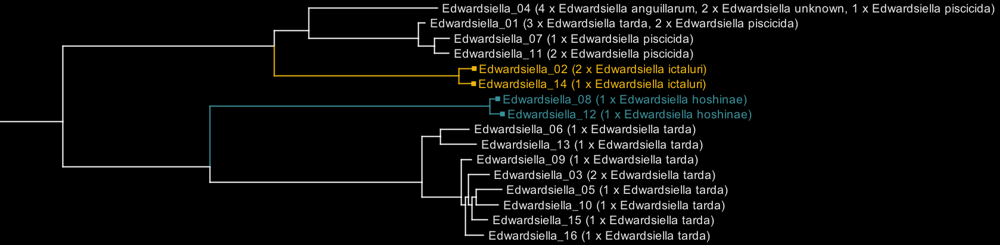
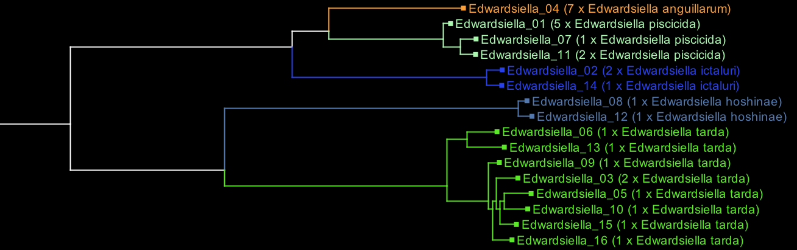

# Bacsort

## Table of contents

  * [Introduction](#introduction)
      * [Problems Bacsort can fix](#problems-bacsort-can-fix)
      * [Uses for Bacsort](#uses-for-bacsort)
  * [Installation](#installation)
     * [Software requirements](#software-requirements)
  * [Instructions](#instructions)
     * [Step 1: download assemblies](#step-1-download-assemblies)
     * [Step 2: cluster assemblies](#step-2-cluster-assemblies)
     * [Step 3: distance matrix](#step-3-distance-matrix)
     * [Step 4: build tree](#step-4-build-tree)
     * [Step 5: curate tree](#step-5-curate-tree)
     * [Step 6: copy assemblies to species directories](#step-6-copy-assemblies-to-species-directories)
  * [Downstream analyses](#downstream-analyses)
     * [Classify new assemblies using Mash](#classify-new-assemblies-using-mash)
     * [Using Bacsort with Centrifuge](#using-bacsort-with-centrifuge)
     * [Using Bacsort with Kraken](#using-bacsort-with-kraken)
  * [Tips](#tips)
  * [FAQ](#faq)
  * [Contributing](#contributing)
  * [License](#license)


## Introduction

[RefSeq](https://www.ncbi.nlm.nih.gov/refseq/) is a wonderful public repository that contains many bacterial genome assemblies, but unfortunately some of its assemblies are mislabelled. This means that you cannot simply use a tool like [ncbi-genome-download](https://github.com/kblin/ncbi-genome-download) to get all assemblies of a particular genus, e.g. _Klebsiella_. If you did so, you would certainly get many _Klebsiella_ assemblies, but you would also get some _E. coli_ and _S. marcescens_ assemblies that were mislabelled as _Klebsiella_. Furthermore, you would miss some _Klebsiella_ assemblies that were mislabelled as something else, e.g. _Enterobacter_.

Bacsort is a collection of scripts to help you solve this problem. The figure below shows an overview of its method: A) downloading RefSeq genomes for genera of interest, B) clustering the genomes to remove redundancy, C) constructing a phylogenetic tree with species labels, D) manual curation of species labels, and E) a consistently named collection of bacterial genome assemblies, where (whenever possible) species are defined as clades on the tree.

<p align="center"></p>

Defining bacterial species is a complex topic, and there is often no perfect solution. Here are some interesting papers on the topic, if you'd like to learn more: [Doolittle 2006](https://genomebiology.biomedcentral.com/articles/10.1186/gb-2006-7-9-116), [Bapteste 2009](https://biologydirect.biomedcentral.com/articles/10.1186/1745-6150-4-34), [Georgiades 2011](https://www.frontiersin.org/articles/10.3389/fmicb.2010.00151/full). But even though it can be a difficult problem, Bacsort can help us work towards a future where bacterial species are defined, if not perfectly, at least more consistently.


### Problems Bacsort can fix

RefSeq genomes can be mislabelled for a number of reasons, and Bacsort can help with each. Sometimes genomes are just given an utterly wrong species. These are usually quite easy to fix:

<p align="center"></p>

Sometimes a new species name has been coined for a group but hasn't yet fully caught on, leaving an awkward mix of the old and new names. That new name can be brought to the whole group:

<p align="center"></p>

Sometimes a group is not well studied, and many samples are not yet named. Bacsort can assign names to samples which are closely related to those with names:

<p align="center"></p>

And sometimes a group is very inconsistently named. These are the toughest problems to fix! The best solution is to find an authoritative piece of literature that defines the species in question, so you can apply that scheme to your assemblies:

<p align="center"></p>


### Uses for Bacsort

* Producing clean sets of genome assemblies for species-level analyses. E.g. if you wanted to analyse the pan-genome of _Citrobacter braakii_, you would want all _C. braakii_ genomes and nothing but _C. braakii_ genomes. Bacsort can help with that!
* Producing curated species labels for the purpose of classifying new genomes. Bacsort can help you build better [Centrifuge](http://www.ccb.jhu.edu/software/centrifuge/) and [Kraken](http://ccb.jhu.edu/software/kraken/) databases (details below [here](#using-bacsort-with-centrifuge) and [here](#using-bacsort-with-kraken)).
* Delineate species boundaries and make/refine species definitions.
* Finding unnamed species in public genomes. For example, [what](https://www.ncbi.nlm.nih.gov/assembly/GCF_002918535.1/) [are](https://www.ncbi.nlm.nih.gov/assembly/GCF_002918555.1/) [these](https://www.ncbi.nlm.nih.gov/assembly/GCF_002918935.1/) [genomes](https://www.ncbi.nlm.nih.gov/assembly/GCF_002919495.1/)? While they are labelled as _Citrobacter amalonaticus_, organising _Citrobacter_ assemblies with Bacsort shows them to be a new species of _Citrobacter_, waiting for a name!
* Submitting revisions to RefSeq, helping to improve that collection's taxonomic consistency.


## Installation

You don't need to install Bacsort - it's just a collection of independent scripts which can be run directly. However, adding the Bacsort directory to your PATH will make the scripts easier to run:

```
git clone https://github.com/rrwick/Bacsort
export PATH=$(pwd)/Bacsort/scripts:"$PATH"
```

If you want to run Bacsort a lot, I'd suggest adding its `scripts` directory to your PATH in your `.bashrc` file (or equivalent) or copying its scripts to somewhere in your path (like `~/.local/bin/`).


### Software requirements

* Running Bacsort requires that you have [Mash](http://mash.readthedocs.io/) installed and available in your PATH. If you can type `mash -h` into your terminal and not get an error, you should be good!
* There are multiple ways to build trees ([more info here](#step-4-build-tree)), but my recommended way requires [R](https://www.r-project.org/) with the [ape](https://cran.r-project.org/package=ape) and [phangorn](https://cran.r-project.org/package=phangorn) packages installed.
* You'll also need [Python 3](https://www.python.org/) and [BioPython](http://biopython.org/). If `python3 -c "import Bio"` doesn't give you an error, you should be good! If you need to install BioPython, it's easiest to do with pip: `pip3 install biopython`
* Depending on how you want to compute pairwise distances, you may also need [FastANI](https://github.com/ParBLiSS/FastANI).


## Instructions

What follows are instructions for using Bacsort to refine the species labels for one or more genera of interest. All Bacsort commands need to be run in the same directory, which I'll call the 'base directory' for the remainder of these docs (or `bacsort_base_dir` in example paths). The scripts will create directories and files in the base directory, so I would recommend creating a new directory for this purpose:

```
mkdir bacsort_results
cd bacsort_results
```

Bacsort will download _all_ NCBI assemblies for your genera of interest, so make sure you have enough free disk space! Each assembly is about 2-3 MB (gzipped), so you'll need many GB for common genera with many assemblies.


### Step 1: download assemblies

This script will use [ncbi-genome-download](https://github.com/kblin/ncbi-genome-download) to download assemblies for your genera of interest:
```
download_genomes.sh "Citrobacter Klebsiella Salmonella Yersinia"
```

It will also make [Mash](http://mash.readthedocs.io/) sketches of the assemblies in preparation for the next step.


### Step 2: cluster assemblies

This script will make a new directory, `clusters` which contains assemblies with redundancy removed:

```
cluster_genera.py assemblies
```

For example, if there are 10 very similar assemblies, they will form one cluster and have only a single representative in `clusters`. Cluster representatives are chosen based on assembly N50 so more completed assemblies are preferred.

This step also produces a file, `cluster_accessions`, which lists the cluster name, followed by a tab, followed by a comma-delimited list of the assemblies in that cluster, with the representative assembly marked with a `*`:
```
Edwardsiella_01	GCF_000020865.1.fna.gz,GCF_000146305.1.fna.gz,GCF_000711155.1.fna.gz,GCF_000804515.1.fna.gz,GCF_002075835.1.fna.gz*
Edwardsiella_02	GCF_000022885.2.fna.gz*,GCF_000264785.1.fna.gz
Edwardsiella_03	GCF_000163955.1.fna.gz*,GCF_000341505.1.fna.gz
Edwardsiella_04	GCF_000264765.2.fna.gz*,GCF_000711175.1.fna.gz,GCF_000800725.1.fna.gz,GCF_000804575.1.fna.gz,GCF_000804595.1.fna.gz,GCF_000804615.1.fna.gz,GCF_001186215.1.fna.gz
Edwardsiella_05	GCF_000264805.1.fna.gz*
Edwardsiella_06	GCF_000264825.1.fna.gz*
Edwardsiella_07	GCF_000348565.1.fna.gz*
Edwardsiella_08	GCF_000474215.1.fna.gz*
```

Before running this command, you may wish to prepare an `excluded_assemblies` file in your base directory ([read more here](#excluding-assemblies)).


### Step 3: distance matrix

As input for the neighbour joining tree algorithm, we need a matrix of all pairwise distances between clusters. There a few alternative ways to produce such a matrix: using [Mash](http://mash.readthedocs.io/), [FastANI](https://github.com/ParBLiSS/FastANI) or a combination of the two.

#### Option 1: Mash

Advantage: simple and fast.

Disadvantage: possibly less accurate and more affected by accessory genes like the presence/absence of plasmids.

This one script will take care of running Mash and converting its output to a PHYLIP distance matrix. Run it in your base directory with one argument specifying the number of threads:
```
mash_distance_matrix.sh 16
```

#### Option 2: FastANI

Advantage: produces pairwise ANI measurements using only the sequence shared by two assemblies. This makes it less swayed by the accessory genome and it may produce more accurate trees.

Disadvantages: FastANI is designed for 80-100% nucleotide identity and will therefore struggle with greater divergences (see [Combining Mash and FastANI distances](#combining-mash-and-fastani-distances) below). It is slower than Mash and not intrinsically parallel, so you'll need to parallelise it one way or another to cope with large datasets.

To run FastANI on your Bacsort clusters in serial (only appropriate for small datasets):
```
fastani_one_thread.sh
```

Or use this script to run it in parallel (in this example using 16 simultaneous processes):
```
fastani_in_parallel.sh 16
```

Or if you have a Slurm-managed cluster, this may be the fastest approach:
```
fastani_with_slurm.sh
# Wait for Slurm jobs to finish
cat tree/fastani_output_* > tree/fastani_output
rm tree/fastani_output_* tree/fastani_stdout_*
```

Once the distances are computed, they must be converted into a PHYLIP distance matrix, which is relatively quick and carried out using this command. We use a maximum distance of 0.2 because FastANI wasn't designed to quantify ANI less than 80%.
```
pairwise_identities_to_distance_matrix.py --max_dist 0.2 tree/fastani_output > tree/fastani.phylip
```

#### Combining Mash and FastANI distances

If you would like, you can use this script to combine FastANI distances (which are very good up to 20% divergence) with Mash distances (which can handle greater divergence) to get a best-of-both-worlds distance matrix:

```
combine_distance_matrices.py tree/fastani.phylip tree/mash.phylip > tree/distances.phylip
```


### Step 4: build tree

There are many tools available for building a Newick-format tree from a PHYLIP distance matrix, and any can be used here.

I prefer the [BIONJ algorithm](https://academic.oup.com/mbe/article/14/7/685/1119804) based on the recommendation of the [this paper](https://wellcomeopenresearch.org/articles/3-33). A simple script is included in this repo to build one from a PHYLIP distance matrix using R's [ape package](http://ape-package.ird.fr/):
```
bionj_tree.R tree/distances.phylip tree/tree.newick
```

Alternatively, there are plenty of other tools and packages for building a Newick-format tree from a PHYLIP distance matrix, including [RapidNJ](http://birc.au.dk/software/rapidnj/), [Quicktree](https://github.com/khowe/quicktree), [BIONJ](http://www.atgc-montpellier.fr/bionj/download.php), [ape](http://ape-package.ird.fr/)/[phangorn](https://github.com/KlausVigo/phangorn) and [PHYLIP](http://evolution.genetics.washington.edu/phylip.html).


### Step 5: curate tree

Run this command to make a tree file which contains the species labels in the node names:
```
find_species_clades.py
```

It produces the tree in two formats: Newick and PhyloXML. The PhyloXML tree is suitable for viewing in [Archaeopteryx](https://sites.google.com/site/cmzmasek/home/software/archaeopteryx). Clades which perfectly define a species (i.e. all instances of that species are in a clade which contains no other species) will be coloured in the tree (using a random colour) to make it clear which parts of the tree do and don't have consistent names.

To illustrate, here is an Archaeopteryx visualisation of _Edwardsiella_, before any curation:

<p align="center"></p>

Each tip on the tree is labelled with the cluster name (e.g. 'Edwardsiella_01') and the species contained in that cluster (e.g. '3 x Edwardsiella tarda, 2 x Edwardsiella piscicida'). The clades for _E. ictaluri_ and _E. hoshinae_ are coloured because they are consistently named, but the other species are not.

You can then focus on the uncoloured parts. As you find species label errors, add them to the `species_definitions` file like this:
```
GCF_000020865   Edwardsiella piscicida
GCF_000146305   Edwardsiella piscicida
GCF_000804515   Edwardsiella piscicida
GCF_001186215   Edwardsiella anguillarum
GCF_000711175   Edwardsiella anguillarum
GCF_000800725   Edwardsiella anguillarum
```

You may have to refer back to the `cluster_accessions` file (made back in step 2) to see exactly which assemblies are in a particular cluster and need to be renamed or else use the `get_cluster_accession_species.py` script ([see more here]((#finding-assemblies-to-relabel))). You can make your own `species_definitions` file from scratch, or you can add to the [one in this repo](species_definitions) which has my redefinitions for Enterobacterales and Moraxellaceae.

You can then run `find_species_clades.py` again to generate a new tree with your updated definitions. This process can be repeated (fix labels, make tree, fix labels, make tree, etc.) until you have no more changes to make.

Here is the _Edwardsiella_ tree after curation, now with all consistent species:
<p align="center"></p>


### Step 6: copy assemblies to species directories

When you are happy with the species labels in the tree, you can run this command to copy assemblies into species directories:
```
copy_assemblies.py
```

It will make a directory titled `assemblies_binned` genus and species subdirectories like this:
```
Moraxella/
    atlantae/
        GCF_001591265.fna.gz
        GCF_001678995.fna.gz
        GCF_001679065.fna.gz
    boevrei/
        GCF_000379845.fna.gz
Psychrobacter/
    faecalis/
        GCF_001652315.fna.gz
        GCF_002836335.fna.gz
    glacincola/
        GCF_001411745.fna.gz
```


Alternatively, you can create a `clusters_binned` directory:
```
copy_clusters.py
```

This is the same as above, except that the redundancy-removed clusters are used instead of all assemblies. The `clusters_binned` directory will therefore be smaller than the `assemblies_binned` directory.


## Downstream analyses

### Classify new assemblies using Mash

[Mash](http://mash.readthedocs.io/) can use your newly organised assemblies to query unknown assemblies and give the best match.

First, build a sketch of all your organised assemblies. You can do this either with `assemblies_binned` (all assemblies) or `clusters_binned` (redundancy-removed), but I'd recommend the latter for performance:
```
cd bacsort_base_dir/clusters_binned
mash sketch -o sketches -s 100000 -p 4 */*/*.fna.gz
```

Now you can use Mash directly to find the distances between your query and all of your reference assemblies:
```
mash dist -s 100000 -p 4 bacsort_base_dir/clusters_binned/sketches.msh query.fasta | sort -gk3,3
```

Or you can use this script with comes with Bacsort:
```
classify_assembly_using_mash.py bacsort_base_dir/clusters_binned/sketches.msh query.fasta
```

This script has some additional logic to help with classification:
* The `--threshold` option controls how close the query must be to a reference to count as a match (default: 5%)
* The `--contamination_threshold` option helps to spot contaminated assemblies. If the top two genera have matches closer than this (default: 2%), the assembly is considered contaminated. E.g. if your assembly is a strong match to both _Klebsiella_ and _Citrobacter_, then something is probably not right!


### Using Bacsort with Centrifuge

You can use Bacsort's assemblies to build a [Centrifuge](http://www.ccb.jhu.edu/software/centrifuge/) database which incorporates your revised species labels. For these instructions, I assume that you've only run Bacsort on _some_ bacterial genera, but you'd still like to include _all_ bacterial genera in the Centrifuge database. I also assume that you've already run all of the Bacsort steps above and produced a `clusters_binned` directory.

To begin, use Centrifuge to download genomes and taxonomy information (more detail is available in the [Centrifuge docs](http://www.ccb.jhu.edu/software/centrifuge/manual.shtml#database-download-and-index-building)):
```
mkdir -p centrifuge_bacsort
cd centrifuge_bacsort
centrifuge-download -o taxonomy taxonomy
centrifuge-download -o library -m -d bacteria refseq > seqid2taxid.map
```

Now from the same directory, run this script to incorporate your Bacsorted genomes into the Centrifuge library:
```
prepare_centrifuge_library.py bacsort_base_dir/clusters_binned .
```

This script does two things:
1. It copies your Bacsorted genomes into the Centrifuge library and makes appropriate entries in the `seqid2taxid.map` file.
2. It _removes_ any genomes already in the Centrifuge library which are in the same genera as your Bacsorted assemblies. This prevent conflicts between the existing species labels and your refined species labels.

Now you can continue building the Centrifuge library (again, head to the [Centrifuge docs](http://www.ccb.jhu.edu/software/centrifuge/manual.shtml#database-download-and-index-building) for more detail):
```
cat library/*/*.fna > input-sequences.fna
centrifuge-build -p 16 --conversion-table seqid2taxid.map --taxonomy-tree taxonomy/nodes.dmp --name-table taxonomy/names.dmp input-sequences.fna bacsort
```

This should create `*.cf` files which comprise your new Centrifuge database - use it like you would any other Centrifuge database! You can now delete any other files made along the way to save disk space.


### Using Bacsort with Kraken

[Kraken](http://ccb.jhu.edu/software/kraken/) is a similar tool to Centrifuge, and you can similarly build a database using Bacsorted assemblies. The assumptions stated above in the [Using Bacsort with Centrifuge](#using-bacsort-with-centrifuge) section apply here too.

First create a bacterial database as described in the [Kraken docs](http://ccb.jhu.edu/software/kraken/MANUAL.html#custom-databases):
```
kraken-build --download-taxonomy --db bacsort
kraken-build --download-library bacteria --db bacsort
```

Now run this script which does two things: 1) adjusts the taxonomy IDs in the Kraken database to match Bacsort's classifications, and 2) prepares additional Bacsorted assemblies for inclusion in the database:
```
prepare_kraken_library.py bacsort_base_dir/clusters_binned bacsort
```

Now we can add the remaining assemblies to the library:
```
for f in additional_assemblies/*.fna; do
    kraken-build --add-to-library $f --db bacsort
done
```

Finally, we build the library (again, please read the [Kraken docs](http://ccb.jhu.edu/software/kraken/MANUAL.html#custom-databases) for more info):
```
kraken-build --build --threads 16 --db bacsort
```


## Tips

#### Updating a Bacsorted collection

If you run Bacsort on some genera of interest, you will produce a `species_definitions` file (see [step 5](#step-5-curate-tree)). If you then come back in a few months and run it again, there will likely be new assemblies that were added to RefSeq in the intervening time. However, this re-run of Bacsort doesn't need to be as much work as the first time, as you can use your same `species_definitions` file so all of the previous corrections are applied right away. This way, you only need to concern yourself with renaming any new additions - hopefully a quick task!


#### Excluding assemblies

Some assemblies should be excluded from Bacsort, usually for one of two reasons:
1. There is something wrong with the assembly. For example, it is contaminated with sequences from a separate sample.
2. The sample is a hybrid between two species. While nothing may be wrong with the assembly, the genome may be inappropriate for species definitions.

The accessions for any assemblies you want to exclude can be put in a `excluded_assemblies` file (in your base directory), and Bacsort will skip them at the assembly clustering step. [A copy of this file](excluded_assemblies) in included in the Bacsort repo, which you can use as a starting point.


#### Finding assemblies to relabel

Let's imagine you're on the [curation step](#step-5-curate-tree) of Bacsort, and you see this cluster in the _E. hormaechei_ clade:<br>
`Enterobacter_051 (4 x Enterobacter hormaechei, 1 x Enterobacter cloacae)`

This cluster has 5 assemblies, one of which is misnamed as _E. cloacae_ and will need to be corrected in the `species_definitions` file. But which one?! The `get_cluster_accession_species.py` script exists for this very purpose. Run it from your base directory like this:
```
get_cluster_accession_species.py Enterobacter_051
```
And you should see an output like this:
```
GCF_002751815 Enterobacter hormaechei
GCF_002925805 Enterobacter hormaechei
GCF_003057395 Enterobacter cloacae
GCF_900075465 Enterobacter hormaechei
GCF_900076955 Enterobacter hormaechei
```

There's our answer: it's GCF_003057395 that must be renamed!


## FAQ

#### Do bacterial species really exist?

Tough question. Yes and no. Check out the papers linked to in the intro. Regardless of your stance on the matter, humans love to categorise things, so even if the concept of a bacterial species can be a bit shaky, I think bacterial species names are here to stay!


#### What average nucleotide identity (ANI) defines a species?

[This preprint](https://www.biorxiv.org/content/early/2017/11/27/225342) suggests there is a clear answer to that question: 5% or less. But I'm sceptical that is compatible with species names as they are actually used. For example, genomes in _Klebsiella oxytoca_ tend to be about 1% divergent from each other. Genomes in _Photorhabdus luminescens_ are more like 5% divergent. And genomes labelled _Buchnera aphidicola_ are on average a whopping 18% divergent from each other! Setting any single threshold would be incompatible with so many existing species names that I don't think it's realistic.


#### What about horizontal gene transfer (HGT)?

The more HGT present in a population of bacteria, the less appropriate it is to organise their genomes in a tree, i.e. HGT makes the phylogeny more network-like and less tree-like. This is a shortcoming of Bacsort, which uses trees to organise genomes and assumes that a 'clade' is a real thing. Bacsort also builds trees using distance matrixes which, unlike alignment-based phylogenetics, have no good way to filter out the effect of HGT. However, I think that on the whole, HGT probably does not affect the structure of Bacsort's trees enough to be a problem, at least not when making species-level distinctions. If you disagree with that statement, please let me know - I'd be interest to hear your views!


#### What's the deal with _Shigella_?

_Shigella_ species are all phylogenetically contained within _E. coli_ and I would argue they shouldn't really be separate species at all, let alone in a separate genus. I think it would be more accurate to consider these bacteria to be pathotypes of _E. coli_, not separate species. Read more about it here: [Johnson 2000](http://jmm.microbiologyresearch.org/content/journal/jmm/10.1099/0022-1317-49-7-583), [Robins-Browne 2016](https://www.frontiersin.org/articles/10.3389/fcimb.2016.00141/full). For the purposes of Bacsort, I consider _Shigella_ to be part of _E. coli_, and Bacsort will put _Shigella_ assemblies in the `Escherichia/coli` directory.

This raises the debate about how much phenotype should be a factor in species definitions. I would argue that phylogenetics is paramount, but others may disagree.


#### What about other taxonomic ranks?

Bacsort focuses on the species-level distinction, and assumes that a bacterial species forms a clade in its larger phylogenetic tree. What about higher ranks - do genera form nice clades? Or lower ranks - subspecies?

While I haven't explored this much, I suspect you'll run into difficulties in both directions. Higher ranks often do not form clades (e.g. the genus _Klebsiella_ is not a clade unless you also include _Raoultella_), and the concept of a tree probably breaks down with more distant relationships (see [Dagan 2006](https://doi.org/10.1186/gb-2006-7-10-118)). For lower ranks, the issues caused by HGT ([see more here](#what-about-horizontal-gene-transfer-hgt)) may become even more pronounced, as HGT within a species can be common.


## Contributing

When you run Bacsort, you will produce a `species_definitions` file (see [step 5](#step-5-curate-tree)) that contains corrections for your genera of interest. If you would like to share these fixes with the world, please share them via an [issue](https://github.com/rrwick/Bacsort/issues) or [pull request](https://github.com/rrwick/Bacsort/pulls), and I'll incorporate them into the `species_definitions` file that is bundled with Bacsort.

This invitation is especially extended to anyone who considers themselves an expert in a particular taxon. If you understand a group of bacteria better than anyone else, then you should be the person who helps to define the species!

Users are also welcome to modify/enhance the Bacsort code. If you do, please submit an [issue](https://github.com/rrwick/Bacsort/issues) or [pull request](https://github.com/rrwick/Bacsort/pulls).


## License

[GNU General Public License, version 3](https://www.gnu.org/licenses/gpl-3.0.html)
